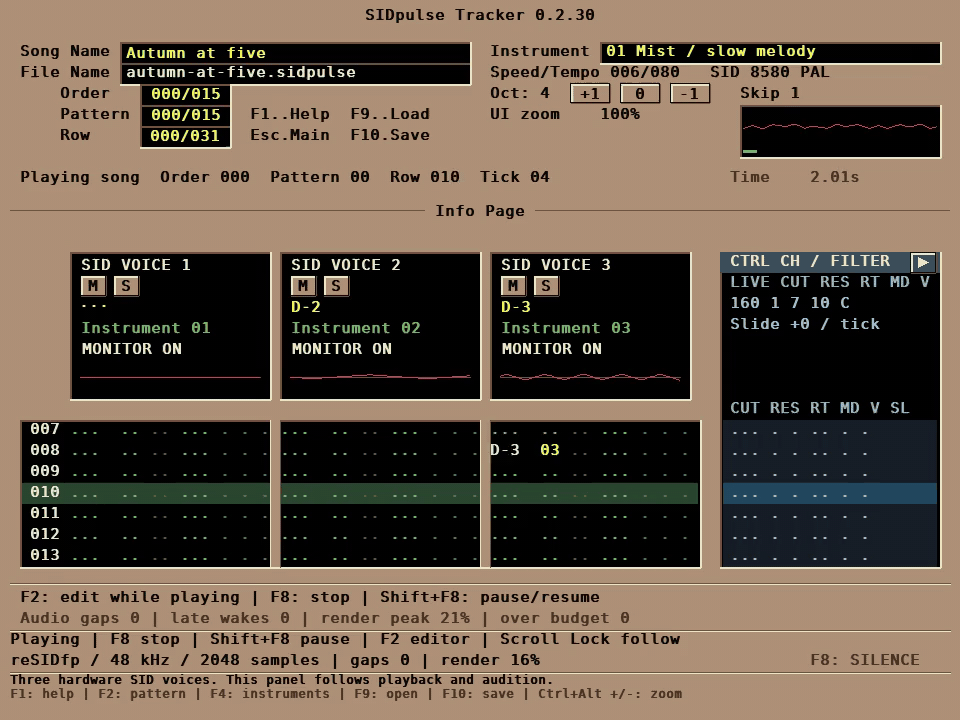
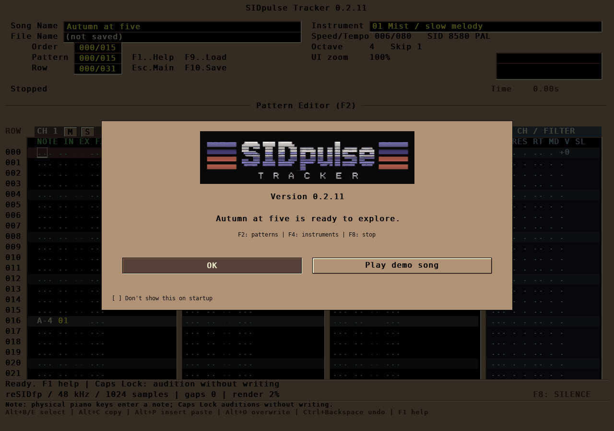
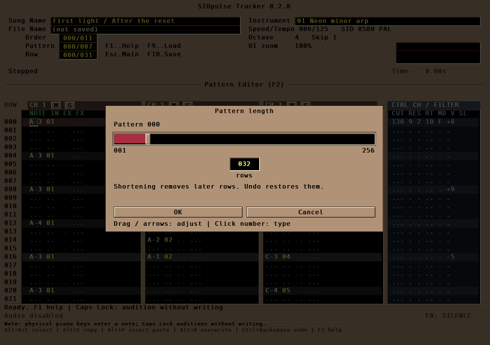
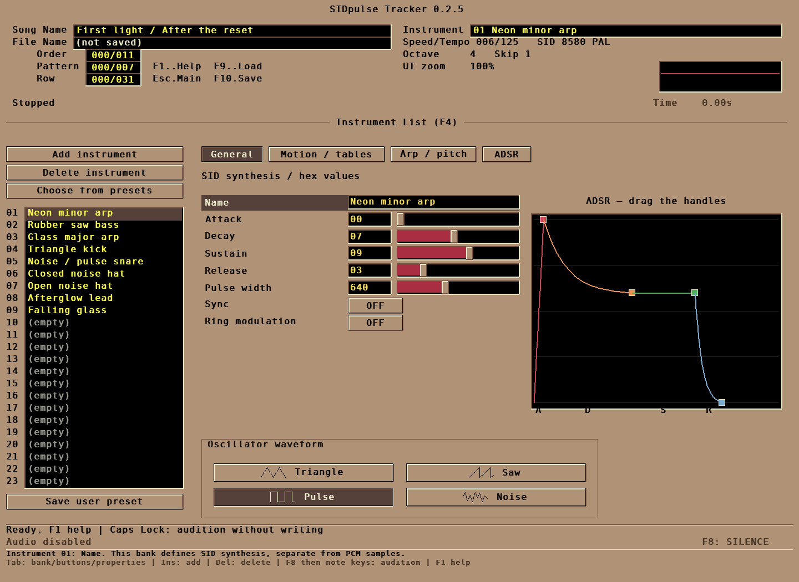

# SIDpulse Tracker


> **ATTENTION:** [FlyingFathead/sidpulse-tracker](https://github.com/FlyingFathead/sidpulse-tracker/) is the one and only official, original source for **SIDpulse Tracker**. Steer clear of other sources or repositories claiming to be the official project.



[Watch Autumn at Five with audio (full song, 1:36)](docs/media/sidpulse-f5-playback-full.mp4)

## Features at a glance

- **Three SID voices:** compose for 6581 or 8580, PAL or NTSC, with native reSIDfp playback.
- **Tracker workflow:** patterns, orders and instrument editing, with Modern and Classic keyboard layouts.
- **Channel automation:** edit or record A/D/S/R and pulse width; override instruments without changing their original settings.
- **Flexible editing:** select individual columns, copy notes or automation, paste special and undo changes.
- **Live feedback:** three voice scopes, channel and instrument mute/solo, and audio performance counters.
- **C64 exports:** SID and runnable PRG files, with four SQUEEZER versions, all-version comparison (optional Top 3) and measured size, RAM and playback cycles.
- **Editable projects:** `.sidpulse` saves include version information and compatibility warnings when applicable.

## Quick install

Download the **full ZIP** and **SHA256SUMS-v0.2.30-final.txt** for this version. Use
Python 3.10+; Python 3.12 is tested. The launchers create a local `.venv` and
install the pinned dependencies on first launch, which needs internet access.

**Linux**, from the download directory:

```bash
sha256sum --check --ignore-missing SHA256SUMS-v0.2.30-final.txt &&
unzip sidpulse-tracker-v0.2.30-final-full.zip &&
cd sidpulse-tracker &&
./run.sh
```

**Windows:** [verify and extract the full ZIP](#windows), then double-click
`run.cmd` inside `sidpulse-tracker`. Accept the first-run setup when prompted.

Press **F5** to play, **F2** to edit patterns, **F4** for instruments and **F8**
to stop. Keep the launcher terminal open while the tracker runs. For an existing
installation, use the [v0.2.30 overlay instructions](docs/APPLY-v0.2.30.md).

**The official site of SIDpulse Tracker, a homage to Impulse Tracker, reimagined as a modern SID-native tracker.**

Created by [FlyingFathead](https://github.com/FlyingFathead). Runs on native Python + pygame-ce desktop application, with Impulse Tracker and Schism Tracker as the main keyboard keymap and visual reference.

> NOTE: This project is more or less a WIP (work-in-progress) at this stage, although the program is fully functional. Still, don't expect too much at this point, because the software hasn't been through years of extensive testing. I needed a SID tracker for my Commodore 64 projects, none of them had the classic Impulse Tracker interface, so I made this. *This is a hobby project, and that's it.*

## v0.2.30: smaller exports, version comparison and visible scrollbars

**SQUEEZER v2.0.2** uses short IDs for repeated literal blocks and phrase calls.
It saves another **1,245 bytes** on the native v8 stress arrangement, after
including the larger player and dictionary. All three earlier versions remain
available. **Show all versions** is on by default, with results ranked by file
size, resident RAM and measured cycles. Uncheck it for **Top 3**; the checkbox
saves `export_show_all_versions` immediately, including when you cancel export.
The dropdown keeps every version selectable. Ties stay highlighted.

Shared draggable scrollbars now expose overflow in the export panel, pattern
grid, banks, help, settings, menus, file browser and long text. Keyboard and
wheel navigation remain available; scrolling does not edit the song. See the
[scrollbar behavior and implementation](docs/SCROLLBARS.md). The supplied SP
[application icon](docs/DESKTOP_ICON.md) loads once at startup; Linux users can
optionally install a matching application-menu launcher.

Read the [design and reference findings](docs/SQUEEZER-v2.0.2.md),
[performance report](docs/PERFORMANCE-v0.2.30.md),
[validation](docs/VALIDATION-v0.2.30.md), and
[overlay instructions](docs/APPLY-v0.2.30.md).

## v0.2.29: shared playback phrases and three-version export comparison

**SQUEEZER v2.0.1** stores identical playback packet sequences once and calls them
with bounded repeats. v1.0 and v2.0 remain available. The export comparison is on
by default: three columns show output size, resident RAM and measured maximum
C64 cycles, with a **Use Squeezer** button beneath each. The smallest valid result
is selected initially; choose another version immediately or turn comparison off.
Shared analysis runs in the cancellable background worker.

Read the [design and measurements](docs/SQUEEZER-v2.0.1.md),
[release notes](docs/RELEASE_NOTES-v0.2.29.md),
[performance report](docs/PERFORMANCE-v0.2.29.md),
[validation](docs/VALIDATION-v0.2.29.md), and
[overlay instructions](docs/APPLY-v0.2.29.md).

## v0.2.28: lower UI cost and safer pattern editing

The UI reuses rendered cells, M/S buttons and mouse geometry, and avoids scanning
an unchanged song on every frame. M/S and channel visualizers remain on by
default. See the [measured performance comparison](docs/PERFORMANCE-v0.2.28.md).

F2 now has **Cut / Copy / Paste / Paste Special / Reset all automation**.
Cut and Reset confirmations start on **Cancel**. Cut includes a saved
**Don't show this again** checkbox; selected fields remain in the clipboard and
can be restored with Undo. Reset always asks before replacing automation.

**Settings Menu > UI Settings** groups display controls and includes an enabled-
by-default **Instrument/sample M/S** toggle. Turning it off hides those buttons
and bypasses instrument monitoring; channel M/S remains available. Parent-menu
buttons stay pressed while their submenu is open.

**Record automation** opens inline in F4, with **Automate what** (A/D/S/R/PW),
**On channel** (1/2/3), and a blue slider. Drag or hold its arrow keys to record.
Only one channel is armed, red with **(A)**, and the bank has a direct Disarm
button. Instrument selection cannot redirect a take. UI Settings retains the
old window as method 1; inline method 2 is the default.

Instrument/sample banks start at 001 on new/load, center through the middle and
clamp at their ends. Their selection survives view changes, independently of
F2's **Center pattern row** preference.

**SQUEEZER v2.0** adds overlap packing. The export panel's **Squeezer version**
dropdown retains **v1.0** for A/B comparison. v2.0 includes v1.0 fallbacks and
uses the same C64 decoder. Squeezed PRGs display the tracker and squeezer versions
before playback. See [squeezer details](docs/SQUEEZER.md).

See [release notes](docs/RELEASE_NOTES-v0.2.28.md),
[validation](docs/VALIDATION-v0.2.28.md), and
[applying the update](docs/APPLY-v0.2.28.md).

## v0.2.26: responsive clipboard buttons and Modern keyboard mode

F2 clipboard buttons now depress while held, activate on release inside, and
show a brief **Copied to clipboard** / **Pasted from clipboard** notice above
**F8: SILENCE**. An empty clipboard gets an explicit notice. Dragging away and
releasing cancels the click; quick clicks still show a short pressed state.

**Settings Menu > Keyboard mapping** selects **Modern** (the new default) or
**Classic**. Modern uses **Ctrl+Insert** to copy and **Shift+Insert** to paste in
F2. Classic preserves the previous shortcuts, including Ctrl+Insert to roll.
Alt+C / Alt+O continue working in either mode. The setting is saved per user.

The header now shows **Oct: 4 [+1] [0] [-1]** controls in pattern, instrument and
sample views. The current value updates immediately; **0 resets to octave 4**.
In Modern mode, **+ / - / 0** also perform these actions in F3/F4. These controls
change the audition/note-entry octave; they do not transpose existing music.

Instrument rows now have **M/S** buttons beside their activity indicators. Mute
and solo follow that instrument across all three voices during playback and
audition. They are session monitoring controls; songs and exports stay intact.
Sample rows show disabled M/S until PCM/digi playback is implemented.

**REC PW: OFF** shows only its arm button. Arming reveals **Record to channel**
and the recording instructions. The arm color defaults to red and supports the
`REC_ARM` color override in user preferences.

Automation resets are now explicit: **R** in an ADSR field restores that
parameter; **RAL** typed in PW restores all five parameters at that row/channel.
The **Reset all automation** button applies all five resets to the current cell
or selected rows/channels. Notes, instruments and FX remain, with one-step undo.
**R then Enter** in PW restores only pulse width. Incomplete R/RA input is
temporary and cancellable. See [automation](docs/AUTOMATION.md).

See [keyboard profiles](docs/KEYBOARD_MAPPING.md),
[release notes](docs/RELEASE_NOTES-v0.2.26.md),
[validation](docs/VALIDATION-v0.2.26.md) and
[applying the update](docs/APPLY-v0.2.26.md).

## v0.2.25: field selection, compact playback and preference reset

Drag across the F2 fields you want, or use **Shift+arrows**, then **Alt+C** to
copy and **Alt+O** to paste at another row/channel. Selecting PW copies only PW;
notes, instruments and effects at the destination remain intact. Click a field
header to select that field for the whole pattern. **Ctrl+Shift+V** opens Paste
Special with Notes / Automation / Both choices. The Copy / Paste / Paste Special
buttons can be hidden in Settings.

A triangle collapses or expands the blue **CTRL CH / FILTER** pane in F2 and
playback Info. Narrow windows start collapsed to fit all three tracks; an explicit
choice is saved across views and restarts. Red per-channel scopes also fit narrow
Info panels. **Channel visualizers** in Settings disables both their drawing and
the display-only SID scope processing when off.

The bottom of **Esc > Settings Menu** now has **Reset all settings to defaults**.
Its confirmation starts on **Cancel**. Reset restores user preferences including
audio, appearance, autosave and display options. Songs, instruments, patterns,
presets and existing recovery files are preserved.

See [pattern selection and clipboard](docs/PATTERN_EDITING.md),
[release notes](docs/RELEASE_NOTES-v0.2.25.md),
[validation](docs/VALIDATION-v0.2.25.md) and
[applying the update](docs/APPLY-v0.2.25.md).

Both launchers print the current version and a terminal-width warning banner.
Keep that console open while the tracker runs. Ctrl-C in the console interrupts
the program without the normal save prompt; use the application's Quit command
to exit normally.

## v0.2.24: channel automation and PW recording

F2 now shows **NOTE IN EX FX A D S R PW** on every voice. The teal automation
fields control the sounding voice: ADSR accepts one hex digit each and PW uses
three hex digits. Blank holds; **R** restores an ADSR setting, **R then Enter**
restores PW, and **RAL** in PW restores all five channel overrides. Existing
notes, instruments and FX keep their established positions and meanings.

**F4 > General > REC PW** records Pulse width slider movements into the chosen
channel's PW rows while playing. **Ctrl+Shift+R** arms recording, **Record to channel**
chooses the voice, releasing keeps the take and **Ctrl+Backspace** undoes it.
Recording uses row steps and ends at the current pattern pass boundary. The
instrument preset stays intact. ADSR can be entered directly in F2.

The main status line follows the cursor or active gesture. The blue shared-filter
lane now also appears in the playback Info page with live values, including
paused/stopped views. Native saves record the app version; newer compatible files
open with a warning and unfamiliar fields are preserved. Ordinary projects stay
format 6; projects using new row automation use format 7.

See [automation and recording](docs/AUTOMATION.md),
[compatibility details](docs/SIDPULSE_FORMAT.md),
[release notes](docs/RELEASE_NOTES-v0.2.24.md) and
[validation](docs/VALIDATION-v0.2.24.md).

## v0.2.23: output selection and test arpeggio

**Alt+F12** now includes an output-device list, **Test arpeggio**, **Refresh
outputs** and **Reset defaults**. Choose System default or an output exposed by
SDL on Linux/Windows. The short C-E-G-C test previews the selected output and
buffer without changing the song or saving preferences. Playback waits during
the test and resumes afterwards, retaining its queued PCM and pause state.

**OK** saves the confirmed output name as `audio_output_device` in the machine
config (`null` means System default). Failed selections restore the previous
output and do not save. An unavailable saved output falls back to System default
at startup; its saved name remains available for reconnection. Reset defaults
stages System default, 2048 samples and underrun detection ON; OK saves it.

Device discovery is on demand. Ordinary playback retains the isolated audio
process, two-block reserve and existing SID/conditioner path. See
[validation and performance](docs/VALIDATION-v0.2.23.md) and
[release notes](docs/RELEASE_NOTES-v0.2.23.md). Native Windows hardware validation
remains separate from Linux SDL dummy tests.

## v0.2.22: isolated audio and underrun diagnostics

Audio now runs in its own spawned process, keeping UI Python stalls away from
the SID renderer and SDL callback. PCM block handling and output conditioning
are faster without changing the 48 kHz rate, audio quality, 2048-sample default,
two-block reserve or song/export semantics.

**Alt+F12** opens audio settings. A saved **Detect audio underruns / warn**
checkbox defaults to ON (`audio_underrun_detection: true` in the machine config).
An underrun produces a small reddish lower-left status message for 12 seconds;
it never opens a popup or steals focus. Late callbacks have a separate message.
Raw diagnostic counters remain available when notifications are disabled.

See [performance and regression evidence](docs/VALIDATION-v0.2.22.md),
[release notes](docs/RELEASE_NOTES-v0.2.22.md) and
[audio architecture](docs/PLAYBACK.md). The recorded tests use Linux SDL dummy
output; Windows hardware playback remains a separate validation step.

## Retained from v0.2.21: responsive SID/PRG export analysis

Opening Export now shows the squeezer immediately, with an animated activity bar
using the current slider-fill colour (no slider handle), real compiler phase
labels and elapsed time. Song copying and compilation run outside the display
thread, in a coordinator thread and a separate Python worker process respectively.
The window continues rendering and processing resize, close and Cancel events.

This also covers **Analyze** and the re-analysis needed after changing options
before **Save + export** or **Export only**. Busy controls prevent duplicate jobs;
Escape/Cancel stops the worker without saving preferences, the song, or an export.
Successful analysis is reused for export. Errors are displayed in the dialog and
late results cannot replace a cancelled/newer dialog. No new dependency, player
binary, encoding, audio setting or native song format is introduced.

The moving bar is an **activity indicator**, not a fabricated completion percentage
or an estimated time remaining. The optimizer can still take several seconds.
See [release notes](docs/RELEASE_NOTES-v0.2.21.md),
[validation](docs/VALIDATION-v0.2.21.md) and [export controls](docs/SQUEEZER.md).

## Retained from v0.2.20: strict replay test-reference repairs

The development-only py65 timing adapter remains intact, along with exact cycle
and SID-write assertions. The preceding v0.2.20 full suite passed on the user's
Linux environment (979 tests, as reported by the user); that is a baseline result,
not a substitute for validating this new asynchronous GUI path.

## Retained from v0.2.19: automatic channel-phrase squeezing

**Squeeze song** remains enabled by default for SID/PRG exports only. The exporter
now compares counted per-channel phrases, shared register-order templates,
independent register-value streams, and cost-optimized static phrase banks.
Repeated bass/drum parts share storage underneath a changing lead, without
changing the IT-style editor. The player reads the packed representation directly;
there is no whole-song expansion buffer. Native songs, preview and undo are unchanged.

Complete PAL exports: **First light SID 22,552 → 6,496 bytes, PRG 24,477 → 6,809**;
**Autumn at five SID 11,174 → 3,600 bytes, PRG 13,099 → 3,913**. These compare the
legacy opt-out with the new default. The latest v0.2.18 candidate's SID figures
were 8,638 and 4,717 bytes respectively; this is an additional improvement.

The compiler compares full resident footprints, verifies reconstructed events,
and executes the selected machine-code player through full pass/loop/re-init
checks. It rejects a compact candidate that exceeds its instruction-cycle reserve.
`--no-squeeze-song` retains exact legacy output. No new runtime dependency is added.

This is a **source candidate**, not a published or fully hardware-validated release.
Native GUI/audio, py65, 64tass and VICE/real-target release gates remain open in the
build environment. Ordered tick/write equivalence is not cycle-identical spacing
inside a tick. See [design/options](docs/SQUEEZER.md),
[measurements and actual validation](docs/VALIDATION-v0.2.19.md), and
[release notes](docs/RELEASE_NOTES-v0.2.19.md).

## Retained from v0.2.17: startup splash now makes the choice explicit

The startup splash now offers **New song / Play demo song**. **New song** (and
Escape) creates a genuinely blank `Untitled` project instead of leaving the
bundled **Autumn at five** demo in the editor. **Play demo song** keeps the demo
loaded and starts it as before. The saved **Don't show this on startup** preference
and explicit `--play-welcome-song` behavior are unchanged.

## Retained from v0.2.16: one file browser and editable filenames

**F9 Load, F10 Save, Save As, SID export and PRG export share the same directory
browser.** Filename and Directory are inline fields, not popups hiding the list.
Left/Right and Home/End move a real caret; Shift selects, Backspace/Delete edits,
and Ctrl+A/C/X/V selects/copies/cuts/pastes. Click to position the caret.

The current project's latest successfully opened/saved name is prefilled.
Save starts just before the extension without selecting the whole name:
`work_v21.sidpulse` can become `work_v22.sidpulse` by editing only that digit.
Folder navigation keeps the draft; a successful Save As becomes the next F9/F10
default. F10 now always opens the browser. **Ctrl+S/W remains quick-save** outside
it; inside Save it submits the visible name. Overwrites ask first (Cancel default),
and errors/cancelled confirmations retain the editable draft. Export keeps the
native project's path and saved/dirty state unchanged.

**Tab / Shift+Tab** changes focus; **Ctrl+L** edits the directory inside the
browser; **Alt+Up** goes to its parent; Enter submits; Escape cancels. Directories
and optional modified dates stay visible. See [browser guide](docs/FILE_BROWSER.md).

All features below are included in the **v0.2.23 source candidate**; earlier
incremental patches are not required. After publication, obtain the full ZIP and
its checksum from [GitHub Releases](https://github.com/FlyingFathead/sidpulse-tracker/releases).
The intended public release assets are `sidpulse-tracker-v0.2.23-full.zip` and
`sidpulse-tracker-v0.2.23-SHA256SUMS.txt`. Incremental/checkpoint update packages
are a separate local-maintenance workflow, not required release downloads.
Song files, existing audio-buffer defaults and dependencies are unchanged
by the file-browser update. See [issue/fix report](docs/ISSUES-v0.2.16.md) and
[validation](docs/VALIDATION.md).

## Retained from v0.2.15: playing-instrument dots, clearer ADSR and song looping

**F4 instrument bank:** dots at the right flash on actual note triggers and stay
lit while a voice is gated. Song/pattern playback and keyboard/cell/row audition
are supported. Selection alone does not light them. Short visual persistence
keeps drum hits visible; these are activity indicators, not volume meters.
**F3 sample dots stay idle** because PCM/digi playback is not implemented yet.

**General / ADSR:** attack `00` now draws vertically and the handle reaches the
left edge. This is a schematic fastest-setting marker: SID attack 00 is nominally
about 2 ms, not zero time. The graph now states that and shows the approximate
clock-scaled attack time. Sound-engine/register behavior is unchanged.

**F11:** the bottom **Loop song when the playlist ends** control is ON/OFF;
press **L** or click it. ON restarts at order 000; OFF stops at the end. Ctrl+S
saves it with the project. **F12 > Loop song at end** is the same setting;
F6's pattern loop stays separate. Final-row loop changes are now honored at the
next end boundary. Previously saved OFF remains OFF.

## Retained from v0.2.14: type the octave directly in the note field

In F2, move the cursor onto the final digit of a note and type **0..7**:
`D#5` + `4` becomes **`D#4`**, retaining the pitch class, instrument and effects.
The cursor then follows the existing **Skip** setting (Skip 0 stays put).
**Ctrl+Backspace** undoes the edit; **Ctrl+Shift+Backspace** redoes it.

The complete physical piano range is unchanged in the note-name slot. Numeric
entry takes priority only in the octave slot. Letter piano keys still work
there, and **Caps Lock keeps audition non-destructive**. Numeric keypad input
works when Num Lock produces a digit. Octaves 8/9 are outside the current 0..7
range and are rejected; digits never turn blank, release or cut cells into notes.

Oversized SID exports still refuse to run and now lead with **"Shorten or
simplify the project and try again"**, followed by exact byte counts. There is
no automatic musical simplification or change to the export budget.
See [octave-input issue and fix report](docs/ISSUES-v0.2.14.md) and
[validation](docs/VALIDATION.md).

## Features retained from v0.2.13: editable beat grid and export diagnostics

**F12 > Grid: rows per beat / Grid: beats per bar** now controls pattern and
filter-lane shading. Defaults remain 4/4 (4-row beats, 16-row bars). For a
12-row-per-quarter shuffle, set 12/4 for 48-row bars. Enter values in decimal;
Ctrl+S stores the display grid in the project. This never retimes notes or
changes tempo/speed. Highlight phase restarts at each pattern's row zero.

Entering an implemented effect no longer incorrectly says that sequencing is
pending. Unsupported commands remain editable and are explicitly labelled.
An oversized PSID export now reports the exact player, unique-record and
pointer-table sizes, including the excess over the existing memory budget.
The compact-player limitation is **not** fixed by this diagnostic change.

See [issue report and proposals](docs/ISSUES-v0.2.13.md),
[grid details](docs/PATTERN_GRID.md) and [validation](docs/VALIDATION.md).

## Features retained from v0.2.12: 2048-sample default audio buffer

Fresh installs and machines without an explicit saved audio-buffer preference now
start at **2048 samples / 42.7 ms per buffer**, twice the previous 1024-sample
default. Existing explicitly saved buffer preferences are retained unchanged.

## Features retained from v0.2.11: Startup splash

The splash appears on every normal startup by default, with the version number
beneath the logo and **New song / Play demo song** buttons. New song creates a
blank **Untitled** project; Play starts **Autumn at five** and keeps the arrangement editable.

A small **[ ] Don't show this on startup** checkbox sits in the lower-left corner.
It starts unchecked when there is no saved choice. Either button saves its state
as `hide_welcome_on_startup` in the per-user `preferences.json`: `true` hides the
splash; `false`, a missing flag or an invalid value shows it. Old `first-run.json`
markers no longer suppress the splash. Escape works like New song.

Use `bash run.sh --welcome` or `.\run.cmd --welcome` to reopen it, even when
hidden. Uncheck the box and choose New song to restore the splash on future startups.
The preference survives replacing the checkout and subsequent application updates.
Launch without arguments for the normal flow; `--example` explicitly opens
First light and bypasses the splash, as does opening a saved project.



## Features retained from v0.2.10: Autumn at five and PRG export

The new welcome track is **Autumn at five**: 96 seconds of quiet, early-morning
woodland music at 80 BPM, with soft triangle swells, gentle arpeggios and delayed
vibrato. The triangles pass through the SID low-pass filter for a rounded,
sine-like tone. All three voices, patterns and instruments remain editable.

Start the tracker and play the welcome song directly:

```bash
bash run.sh --play-welcome-song
```

On Windows: `.\run.cmd --play-welcome-song`. **F8** stops; **F2** opens the patterns.
`--welcome` shows the startup splash again. `--silent --play-welcome-song`
opens the arrangement without an audio device. The bundled source is
`sidpulse/assets/autumn-at-five.sidpulse`; opening it through the welcome flow
creates a fresh editor document, so saving asks for your own filename.

**First light remains included**, with its original editable and PAL/NTSC SID
files in `examples/`. Use `--example` to open it.

**File > Export PRG** now saves a C64 program you can load and `RUN`. Choose the
matching PAL/NTSC setting before exporting; RUN/STOP returns to BASIC. The PRG
uses the same music player as SID export, including the welcome track's arps,
envelopes, filter and vibrato. No assembler or c1541 is needed for export.

```bash
bash run.sh --play-welcome-song --export-prg autumn-at-five.prg
bash run.sh path/to/song.sidpulse --export-prg song.prg
```

CLI export also saves an editable `.sidpulse` beside the program. PAL and NTSC
welcome examples are included in `examples/`. See [PRG export](docs/PRG_EXPORT.md)
for loading instructions and limits.

## Previous checkpoint v0.2.9: README and docs update

v0.2.9 is a documentation/packaging-metadata cleanup over v0.2.8. Public
installation examples and tracked project notes use repository-relative or generic
paths rather than developer-machine checkout locations. There are no functional
runtime, audio, dependency or project-format changes in this patch.

### Pattern-length controls retained from v0.2.8

**Ctrl+F2** opens a linked **1–256 row slider** with a yellow **three-digit
value field centered underneath**. Drag the slider, or click the value itself
and enter up to three decimal digits. The field and slider update together.
Typing starts only after clicking the value field. **OK** applies the length;
**Cancel / Escape** leaves the pattern unchanged. Shortening can be undone,
including removed notes and filter rows.



### Configurable F5 restart retained from v0.2.7

**Restart on repeated F5** is a saved setting, **OFF by default**. Find it in
F12, or **Settings Menu > F5 restart option**. With it off, F5 starts a stopped
song and opens Info during playback without restarting. With it on, every F5
press starts the song from the beginning. **Ctrl+F5 always restarts**.

The preference is stored as `restart_on_f5` (true/false) in `preferences.json`,
separate from songs. Existing installations default to OFF when the key is absent.

### Playback stability and recovery retained from v0.2.6

- Fix a reproduced SDL/Python deadlock when starting, restarting, pausing or
  closing audio. F5 restart behavior follows the setting described above.
- The complete QWERTY piano range works in the note-name part of F2 NOTE.
  At the octave digit, type 0..7 to change only the existing note's octave;
  letter piano keys still enter notes. Caps Lock previews notes from any voice
  field without writing pattern data.
- **F11** shows the order list and complete pattern bank, with names and row
  counts. Click the black order-number column and type three decimal digits:
  each completed number applies and advances to the next row. Delete removes
  an order and shifts later entries up. Tab switches panels; Enter in the bank
  opens the selected pattern in F2. Unused patterns remain in the bank.
- **Autosave is On by default, every five minutes.** Settings > Autosave settings
  changes the interval (1–60 minutes), folder or On/Off state. Recovery copies
  go into `autosave/` beside the launchers. The folder is created and checked;
  an OK warning explains if it is unavailable. Settings can create/retry it.
- An unclean exit offers the previous session’s latest recovery copy on startup.
  Autosave never overwrites the working project or clears its unsaved status.
- Persistent crash reports include Python/native tracebacks, recent input and
  playback state. A 15-second watchdog records thread stacks if the UI hangs.
  The Windows launcher keeps its console open after a failure. See
  [recovery and crash reports](docs/RECOVERY.md) for locations and limitations.

### Editing controls retained from v0.2.5

- QWERTY note keys remain available while adjusting instrument parameters.
  **Only clicking a yellow value field opens manual entry.** Sliders, graph
  handles, field labels and Enter on a parameter never open a typing prompt.
- New project, Clear all pattern data and Clear all instruments each ask for
  **OK / Cancel**, starting on Cancel. Both clear operations can be undone.
- Every quit request asks for confirmation, including a clean project and the
  window close button. Choices include **Discard & Quit**, with Cancel selected.
- Help uses aligned shortcut/description columns with ruled category headings.
  Instrument labels have inner padding, and Save user preset has a solid dock
  below the list, separated from the status bar.
- The file browser shows green modified dates on the right. **File timestamps**
  in F12, or `file_browser_show_modified` in preferences.json, toggles them.

### Playback and controls retained from v0.2.4

- Continuous SDL audio stream replaces the chain of short mixer sounds. The
  sample-clocked sequencer feeds a bounded reserve; UI redraws never set tempo.
- Separate native waveform monitors in the SID VOICE 1/2/3 panels. These show
  each voice before the shared filter; mute/solo is reflected in the displays.
- General now shows a mouse-editable ADSR envelope beside its linked sliders.
  The larger ADSR tab remains available. Menus use outlined, bevelled buttons;
  horizontal rules separate the bottom status/help groups.
- Audio buffer: a mouse/keyboard slider, current samples/ms, **OK / Cancel**.
  Default **2048 samples**; existing chosen buffer preferences are retained.
- Prepare scheduled SID attacks before retriggering, avoiding the reproduced
  ADSR counter delay in First light. Preview and PSID use the same register writes.
- The SVG-logo welcome now uses the startup splash controls described above.
  Use `--welcome` to see it again. Opening a project bypasses the splash.
- Header field values are vertically centered. Order/Pattern/Row values are also
  horizontally centered; Song Name/File Name/Instrument have extra inner padding.

### Windows launcher (retained from 0.2.3)

Windows now starts with `run.cmd`, a thin wrapper that calls `run.ps1` and
forwards arguments and its exit code. The PowerShell launcher still owns Python
virtual-environment setup, dependency installation and starting the tracker.
Its first-run dependency probe now handles missing packages without a traceback.

The following instrument improvements were introduced in v0.2.2:

The previous patch fixed the empty-slot hover crash, including mouse clicks and window
resizing that put an empty slot under the pointer. All button labels are centered
horizontally and vertically inside a one-pixel outline and raised/pressed bevel.

Motion / tables has On/Off buttons for arpeggio, wave/pitch sequences, pulse
motion, vibrato, automatic gate-off and retrigger. Off preserves parameters and
drawings. The switches work in audition, playback and PSID export, and survive
project saves and user presets. Tab to buttons, arrows to select, Enter to toggle.

Run `bash run.sh --example` on Linux or `.\run.cmd --example` on Windows. **F5** plays First light on loop; **F8** stops.
**F4** opens the instrument bank with real raised buttons, sliders and typed values.

- Browse slots **01–99**, including grey empty slots. Enter on an empty slot opens
  **Choose preset / No preset / Manual**. Add/Delete buttons are above the list.
- **39 built-in presets**, including all nine First light instruments, grouped by
  Melodic, Percussive, Bass, Leads, Major arps, Minor arps, Fifths, Noise and FX.
  Built-in and User lists are separate. Save user preset stores your own sounds.
- General, Motion / tables, Arp / pitch and ADSR are mouse and keyboard buttons.
  Every numeric instrument parameter has a slider and an editable numeric field.
  Arps/pitch have a drawable piano grid. **ADSR sliders and draggable envelope
  handles stay synchronized**, including native saves and keyboard audition.
- **PAL / NTSC** changes the SID clock, pitch calculation, and PSID CIA timing.
  The selected musical tempo stays the same. F12 controls song/export looping.
- Clear separators between every voice in both editing and playback views.
  Three sound voices, with a separate shared CTRL CH / FILTER lane in F2.
- Readable dark text on beige, a heavier font, crimson sliders and scope,
  three editable colour themes, and persistent font settings.
  **Ctrl+F12** opens theme settings; **Shift+F12** opens font settings.
- Visible mouse/keyboard Save / Discard / Cancel buttons and a framed, centred
  About window. Cancel remains the default for instrument deletion.
- The existing Schism-style editing, effects, native reSIDfp sound, buffer
  settings, lossless native saving, song notes, PSID export and M/S buttons remain.

[Controls and preset guide](docs/INSTRUMENTS.md) ·
[Theme/font configuration](docs/APPEARANCE.md) ·
[Remaining placeholders](docs/PLACEHOLDERS.md) ·
[Validation](docs/VALIDATION.md)



PSID export targets one PAL or NTSC 6581/8580 at $1000. Native projects save as
**.sidpulse format 6 or 7**, with backward-compatible loading of older formats.
It preserves empty instrument banks and pattern references to empty slots.
Format 7 carries row automation; see the compatibility notes below.
SID import, PCM/digi, MIDI and remaining legacy effects are future work.

### Linux: install or update

Download `sidpulse-tracker-v0.2.30-final-full.zip` and
`SHA256SUMS-v0.2.30-final.txt` from the same release into one
directory. The full ZIP extracts under `sidpulse-tracker/`.

```bash
sha256sum --check --ignore-missing SHA256SUMS-v0.2.30-final.txt &&
unzip sidpulse-tracker-v0.2.30-final-full.zip &&
cd sidpulse-tracker &&
bash run.sh
```

For an existing ZIP installation, close the tracker and back up the folder
before extracting the full release over it. The release does not contain
`.git`, `.venv`, `user_songs`, `autosave` or machine preferences. Keep your own
projects outside the bundled `examples/` and `sidpulse/assets/` directories,
which are release-owned. An overlay replaces shipped source files; it is not
a merge of local source edits. A fresh adjacent folder is also suitable.

For a Git checkout, review and preserve local edits before using
`git pull --ff-only` on `main`, then run `bash run.sh`. Do not extract a release
ZIP over source changes that you intend to keep.

The launcher creates `.venv` and installs the pinned `pygame-ce` and `pyresidfp` dependencies if needed. Python 3.10+ is required; Linux Python 3.12 has been tested. Ubuntu systems may require `python3-venv` if virtual-environment creation is unavailable. `pyresidfp` wheels support common Linux and Windows configurations; building from source requires a C++20 compiler and Python development headers.

To open saved work, use F9 or:

```bash
bash run.sh path/to/song.sidpulse
```

Older song formats load with defaults for newer fields. Saves use format 6, or
format 7 when row automation is present. Newer-version and unsupported-feature
warnings explain partial compatibility; keep an original copy before resaving
such a project. See [native format compatibility](docs/SIDPULSE_FORMAT.md).
Keep songs in `user_songs/` or another location of your choice; checkpoint ZIPs
never include that folder.

## Keyboard transport

| Key | Action |
|---|---|
| F5 | Start song; show Info if already playing. Restart on repeated F5 is optional, default OFF. |
| Ctrl+F5 | Restart the complete song. |
| F6 | Loop current pattern from row zero. |
| Shift+F6 | Play song from current order. |
| Ctrl+F6 | Loop current pattern from the current row. |
| Ctrl+F7 | Set/clear the separate playback mark in F2. |
| F7 | Play from that mark, otherwise the current pattern/row. |
| F8 | Stop song and audition. |
| Shift+F8 | Pause/resume. |
| Scroll Lock / Ctrl+F | Toggle tracing in the pattern editor. Default off keeps editing cursor independent. |

F2 returns to the pattern editor while the song keeps playing. The green row
and left `>` mark indicate playback; the outlined cell remains your edit cursor.
A `*` in the row gutter marks the F7 playback position. F5 uses the song loop
setting: **F11 > Loop song when the playlist ends** or **F12 > Loop song at end**
(on for new songs and First light).
An explicit loop=false in older projects stays off. F6 keeps looping until F8.
An unsequenced pattern selected with F7 plays as a pattern loop.

F4 selects SID instruments. Tab cycles bank/buttons/properties. Enter in the bank
opens the instrument chooser; click a yellow parameter field to type its value.
Keyboard jazz works while stopped: Caps Lock in F2, or
normal note keys in F4. F2 audition uses the selected physical SID voice; F4
allocates three voices. During song playback, note entry edits the source without
stealing its voices for separate audition. Use F8 before auditioning instruments.

F10 opens Save; Shift+F10 opens Save As. Ctrl+S/W quick-saves a named project
outside the browser. Ctrl+Alt +/- zooms; Ctrl+Enter toggles
fullscreen. Schism block keys are Alt+C/Alt+P/Alt+O. Ctrl+C centers the cursor;
Ctrl+Backspace undoes and Ctrl+Shift+Backspace redoes.

## Instruments, filter rows, song notes and export

In F4, switch to properties with Tab, then use PgUp/PgDn or click the General /
Motion tabs. Click a yellow field to type; sliders and envelope handles change
values directly while note keys remain available. Arpeggio and pitch sequences use signed decimal
semitone offsets, e.g. `0 3 7 12`; waveform sequences use `10 20 40 80` hex.
An empty sequence disables it. Arps loop at the chosen ticks/step; wave and pitch
sequences advance each tick and hold their last step. Motion parameters use
decimal values; General SID registers use hexadecimal values.

Press **Ctrl+Shift+F2** for filter focus, move to a row and press Enter. A row has
six values: cutoff, resonance, routing, mode, volume (hex), then signed cutoff
slide (decimal). A dot keeps the previous value; a zero explicitly sets zero.
Example: `380 A 2 10 F -3` routes voice 2 through a resonant low-pass filter and
lowers cutoff by three units each tick. Tab returns to voice editing. Ctrl+F2
continues to edit pattern length. Alt+Insert/Delete moves all voices and filter
rows together; voice/block editing operates on its selected voice lanes.

**Shift+F9** opens song notes. Shift+Enter inserts a line; Enter commits. Notes
remain in `.sidpulse`, including Unicode and line breaks.

**Ctrl+Shift+E**, or Escape > File > Export PSID, compiles the current document.
The export-only squeezer starts enabled. Choose S to save `.sidpulse` and export,
E to export only, or Escape to cancel. A analyzes changed checkbox settings.
An export alone never marks unsaved edits as saved. F12 offers PSID released text
and whole-song loop. Existing export files get an overwrite prompt and backup.

For a command-line export that also saves a native source:

```bash
bash run.sh --example --export-sid user_songs/first-light.sid
# Or export an existing project; a sibling .sidpulse is always saved:
python -m sidpulse user_songs/song.sidpulse --export-sid exports/song.sid
```

`--save-project PATH` changes the native-save destination for a CLI export.
The bundled 6510 player requires no assembler, emulator executable or extra
runtime package on your machine.

## Clear commands and file dates

Escape > File starts with New project, Clear all pattern data, and Clear all
instruments. Each asks for OK / Cancel and defaults to Cancel. Clearing patterns
empties their voice cells and filter rows while keeping pattern numbers, names,
lengths, the order list, instruments and song notes. Clearing instruments removes
the whole bank while retaining patterns and their instrument numbers. Both are
single undoable edits. Empty slots play silently until repopulated. PSID export
reports an empty bank or a used empty slot instead of silently omitting its notes;
native .sidpulse saving remains available.

The file browser's Modified column uses local time, `YYYY-MM-DD HH:MM`, for files
and folders. Its default is on. Toggle **File timestamps** in F12, or set
`"file_browser_show_modified": false` in preferences.json. Narrow views hide the
date column to keep filenames readable. Selected dates stay green on black.

## Audio buffers and diagnostics

Press **Alt+F12**, open Escape > Settings > Audio settings, or choose Audio buffer in F12.
Select an output, use Test arpeggio to preview it, or Refresh outputs after
connecting hardware. Reset defaults stages the three audio defaults without
changing appearance or other preferences.
Drag the slider from Less delay to More stability, or use Left/Right. The current
sample count and milliseconds update as you move. OK applies and saves; Cancel
or Escape keeps the original setting. Tab reaches every control; Enter activates
the focused control. There is no numeric-entry prompt. Available steps are 256,
512, 1024, 2048, 4096 and 8192 samples. Default: **2048 samples / 42.7 ms per buffer**.
Existing explicitly saved values are retained; use the slider to change them.
Larger values help tolerate busy or slower PCs but add latency. This displayed
buffer duration is not total output latency:
up to two PCM blocks are queued and the device adds its own buffering.

Applying a buffer setting briefly reopens SDL and resumes from the next generated
position; already queued audio is discarded. The setting persists per machine,
not in your song. `--audio-buffer 4096` overrides it for one launch. Linux config
is `$XDG_CONFIG_HOME/sidpulse-tracker/preferences.json` (normally under `~/.config`);
Windows uses `%LOCALAPPDATA%/SIDpulse/preferences.json`.

The saved **Detect audio underruns / warn** checkbox defaults to ON. Its config
key is `audio_underrun_detection` (true/false). Live warnings appear as a small
reddish lower-left footer message for 12 seconds, with Alt+F12 as the shortcut;
they never open a popup or steal focus. A late callback is labeled separately
from a confirmed PCM underrun. Raw counters remain available when warnings are
disabled. Audio settings also show missing frames and callback timing.

The Info page shows **Audio gaps**: continuous episodes where the SDL callback
requests PCM during playback/audition and none is ready. Each episode counts once,
including a long starvation; normal startup, pauses and idle silence do not count.
The old `gaps` counter polled short-Sound queue state, so its numbers are not directly
comparable. Counters accumulate until Reset audio counters (Settings); reopening
the device preserves these session counters. Late worker wakes, current/peak render
budget and over-budget blocks help distinguish scheduling and rendering pressure.
These are application measurements, not whole-PC CPU usage or definitive proof
of every driver/hardware underrun. A quiet native emulator startup is explicitly
muted; a 5 Hz DC blocker and 5 ms transport ramps condition host PCM only.

## Windows

Download the **v0.2.30 full ZIP and SHA-256 checksum file** from the same release.
In PowerShell, verify the ZIP before extracting:

```powershell
$zip = ".\sidpulse-tracker-v0.2.30-final-full.zip"
$checksums = ".\SHA256SUMS-v0.2.30-final.txt"
$lines = @(Get-Content -LiteralPath $checksums -ErrorAction Stop | Where-Object {
    $_ -match '^[0-9a-fA-F]{64} [ *]sidpulse-tracker-v0\.2\.30-final-full\.zip$'
})
if ($lines.Count -ne 1) { throw "Missing or ambiguous full-ZIP checksum." }
$expected = ($lines[0] -split '\s+')[0]
$actual = (Get-FileHash -LiteralPath $zip -Algorithm SHA256 -ErrorAction Stop).Hash
if ($actual -ne $expected) { throw "ZIP checksum mismatch. Do not extract." }
Expand-Archive -LiteralPath $zip -DestinationPath . -ErrorAction Stop
```

Open PowerShell or Command Prompt in the extracted `sidpulse-tracker` folder
(the one containing `run.cmd` and `run.ps1`), then run:

```powershell
.\run.cmd
```

To start with First light or open your own project:

```powershell
.\run.cmd --example
.\run.cmd "C:\Music\My song.sidpulse"
```

`run.cmd` calls the adjacent `run.ps1`, forwards arguments, and returns its exit
code. If setup is needed, `run.ps1` lists Python, the local environment and the
contents of `requirements.txt` under "The following Python dependencies are
required and need to be downloaded", then asks **Continue? [Y/n]** before making
changes. Enter or Y accepts; N cancels installation. Missing 64-bit Python is installed as Python
3.12 through WinGet for the current user; if WinGet is unavailable, the launcher
prints the official Python download address. Packages are installed into `.venv`.
An internet connection is needed for installation. Later runs reuse the ready
environment and skip the setup prompt. The WinGet options follow Microsoft's
[install command documentation](https://learn.microsoft.com/en-us/windows/package-manager/winget/install).

If calling `.\run.ps1` directly reports "running scripts is disabled", use
`.\run.cmd`. The wrapper starts Windows PowerShell with
`-NoProfile -ExecutionPolicy Bypass -File`; that override applies only to the
launched process. It does not persistently change your execution policy or need
an administrator terminal. Microsoft documents the process-specific option in
[about_PowerShell_exe](https://learn.microsoft.com/en-us/powershell/module/microsoft.powershell.core/about/about_powershell_exe?view=powershell-5.1#-executionpolicy-executionpolicy).

For an existing ZIP installation, close the tracker, back up the folder, verify
the full ZIP as above, then extract it over the installation (use `-Force` with
`Expand-Archive` to allow replacement). User songs, autosaves and `.venv` are not
release contents. Preserve local source edits separately; extraction replaces
files rather than merging them. Git checkouts can update with `git pull --ff-only`
on `main` after reviewing and preserving local changes.

If you prefer manual setup:

```powershell
py -3 -m venv .venv
.\.venv\Scripts\python.exe -m pip install -r requirements.txt
.\.venv\Scripts\python.exe -m sidpulse
```

Direct `run.ps1` remains available where script execution is already enabled.
The CI matrix includes Windows/Linux tests and the Windows CMD-to-PowerShell
first-run path. Check the Actions result for the exact release commit; local
validation does not substitute for the remote matrix. The validation procedure
is recorded in [VALIDATION.md](docs/VALIDATION.md).

## Development, Git and checkpoint delivery

```bash
python -m pip install -e '.[dev]'
python -m pytest -q
python -m sidpulse --headless-smoke --example
python -m sidpulse --log-keys keys.log
```

Public release assets are the **full source ZIP and its SHA-256 checksum file**.
Build them from the checked release tag, not by zipping a working directory.
Local cumulative patches are not public release assets. Do not include Git
history bundles, private project notes, environments, backups or user projects.
Clone the repository for Git history. See [RELEASING.md](docs/RELEASING.md) for
the commit, CI, tag, archive and release-review sequence, and
[release notes](docs/RELEASE_NOTES-v0.2.22.md) for the user-facing change summary.

Repository: [FlyingFathead/sidpulse-tracker](https://github.com/FlyingFathead/sidpulse-tracker).

See [PLACEHOLDERS.md](docs/PLACEHOLDERS.md), [CHECKPOINT.md](CHECKPOINT.md), [VALIDATION.md](docs/VALIDATION.md),
[IT_KEY_COMPAT.md](docs/IT_KEY_COMPAT.md), [COMMANDS.md](docs/COMMANDS.md),
[EFFECTS.md](docs/EFFECTS.md), [PSID_EXPORT.md](docs/PSID_EXPORT.md), [PLAYBACK.md](docs/PLAYBACK.md), [SIDPULSE_FORMAT.md](docs/SIDPULSE_FORMAT.md),
[DECISIONS.md](docs/DECISIONS.md), and the unchanged [v4 roadmap](docs/ROADMAP.md).

---

## Acknowledgment

Thanks to **Lasse Öörni and the GoatTracker contributors** for the extensive
documentation on storing song data more compactly and optimizing playback
routines. The GoatTracker documentation served as a useful reference for
SIDpulse Tracker's squeezer. The implementation is independent; no GoatTracker
code was incorporated. See the
[optimization study](docs/SQUEEZER-v2.0.1.md#goattracker-reference-compressing-the-instruction-not-just-its-results).

## My other Commodore 64-related projects

- [audio-bitsqueezer](https://github.com/FlyingFathead/audio-bitsqueezer) — Convert audio into compact 4-bit SID samples and playable C64 programs or EasyFlash cartridges, with a command-line interface and local browser UI.
- [c64-3d-toolkit](https://github.com/FlyingFathead/c64-3d-toolkit) — Compile low-poly wireframe models and Blender scenes, animations and physics into C64 demos, with OBJ/MTL and SVG import support.

---

## Credits

SIDpulse Tracker has been made by [FlyingFathead](https://github.com/FlyingFathead/). Special thanks to: ChaosWhisperer